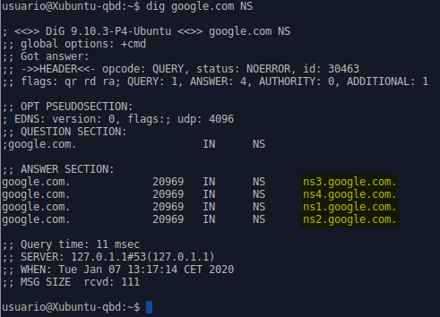
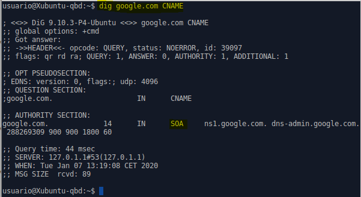
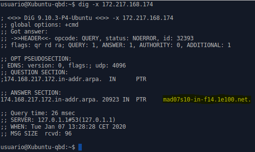

# Actividad de Registro

>usuado el comando dig en los sistemas operativos Linux

    dig <server o ipserver> <Tipo de registro>
    
## Tipos de registros 
 
Vamos a ver quien es el host del servidor(ver la direcion ip del servidor DNS de una pagina web) para ello pondremos:

        dig <nombre_web.com> A

Tambien existe los registro AAAA que lo unico que difiere con los regidtros A es que en vez de ser IPv4 es en IPv6

        dig <nombre_web.com> AAAA

Esa pagina tiene un servidor de correo ? para saberlo introduciremos el siguiente comando

        dig <nombre_web.com> MX

Ahora vamos ha ver que servidor DNS el que manaeja los registros de recuerso de la pagina web , esto lo consegimos ejecutando esto :

        dig <nombre_web.com> SOA
        
Veremos el nombre o nombres de servidor DNS de la pagina web , con el siguiente comando: 

        dig <nombre_web.com> NS

Para saber si utiliza un alias el servidor DNS , es poniendo :

        dig <nombre_web.com> CNAME

Para hacer la conversion de direcion IP a nombre es con :

        dig -x <IP_host> 

Para ver todos los registros DNS de la pagina web , ejecutando este comando : 

        dig <nombre_web.com> ANY
        
## Ejemplos

usaundo google.com

1. dig <nombre_web.com> A

2.2 dig <nombre_web.com> AAAA

3. dig <nombre_web.com> MX

4. dig <nombre_web.com> SOA

5. dig <nombre_web.com> NS

 6. dig <nombre_web.com> CNAME
 
 
 
7. dig -x <IP_host>

8. dig <nombre_web.com> ANY

